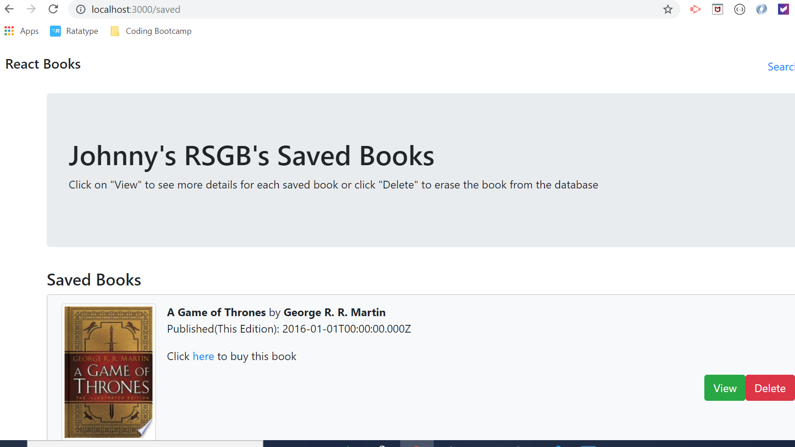
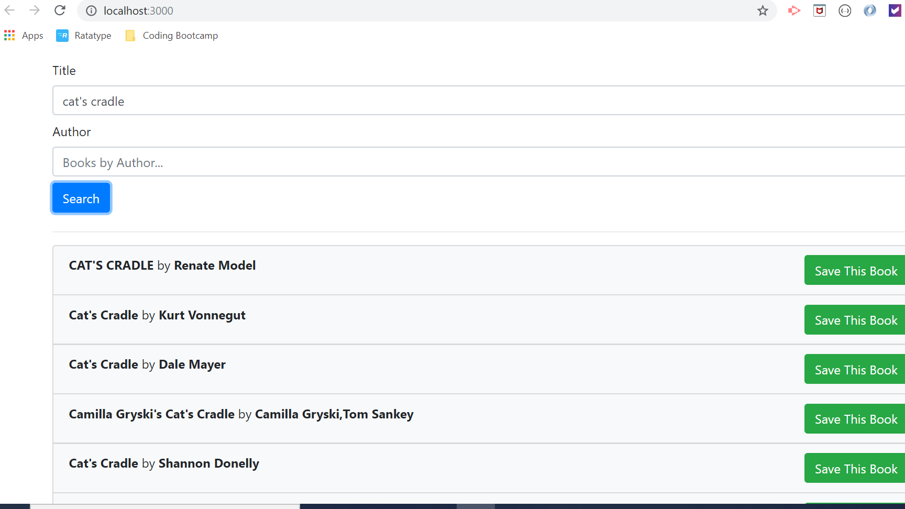
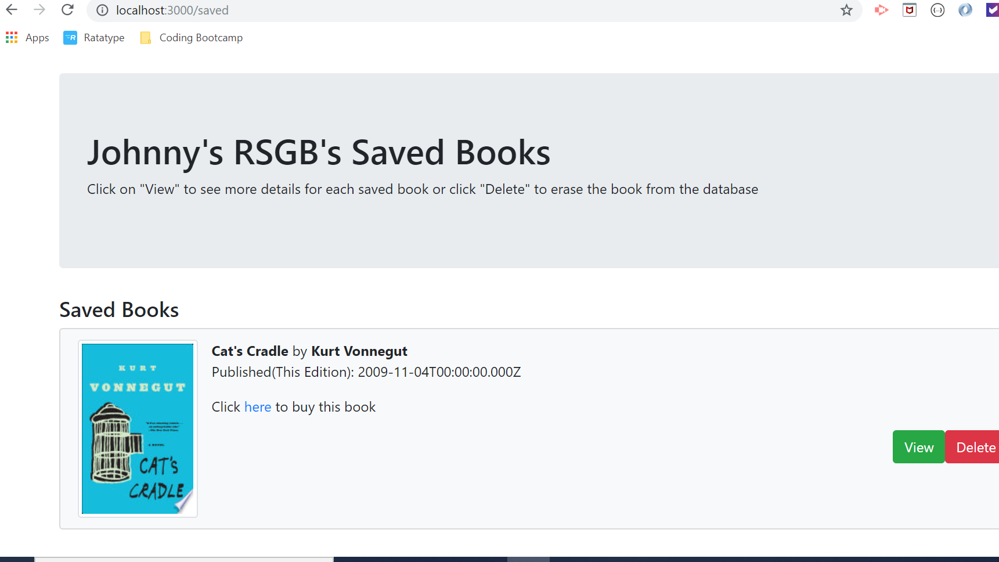

# ReactGoogleBooks
Johnny's RSGB: A ReactJS Search App for Google Books

This App allows users to search for books via the Google Books API. Saved books can then be seen in greater deatil on the "Saved" page, which allows users to see a detailed Synopsis for each book or even link to Google Books to buy what they found

More feature, including account management, to be added soon!

### Screenshots

### Search Results

### Saved Books

